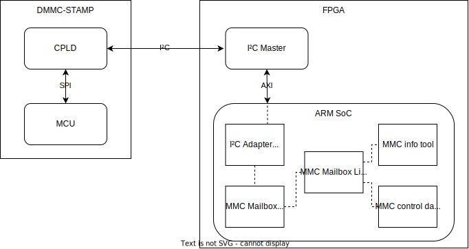
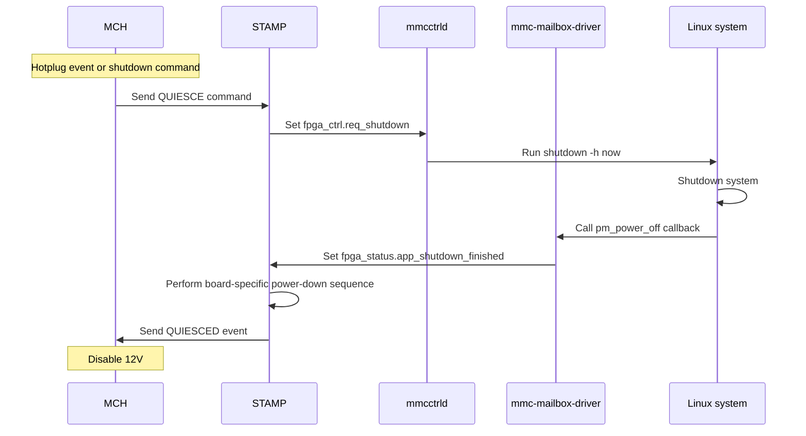

# mmc-mailbox

The MMC mailbox is a data interface between the DMMC-STAMP and the AMC payload (typically a Linux system running on a FPGA/SoC).

It is implemented as a dual-port RAM on the DMMC-STAMP CPLD which emulates an `at24`-like I²C interface.

The DMMC-STAMP provides following information on the mailbox:

* MMC information (SW version, HW revision, slot number, etc)
* MMC sensors
* For all FRUs:
    * Status (present, compatible, powered, error)
    * FRU information (vendor, product, serial number, etc) if available
    * Temperature sensors (if available)

It also implements FPGA/SoC status and control flags that are primarily used to implement an orderly Linux shutdown when the MMC powers down the payload.

There is a 256 byte area reserved for application-specific usage.

## Locking

To avoid race conditions, the MMC mailbox uses double-buffering. The uppermost byte has a "lock" flag preventing the STAMP from switching the page. This lock flag is transparently handled at driver level, as soon as more than one byte is read or written.

## Block diagram



On the Linux software side, there are following components:

* I²C Adapter Driver: This can be any I²C adapter driver, but in order for the shutdown signaling to work, it needs to implement `master_xfer_atomic()`. See [`i2c-xiic-atomic` on GitHub](https://github.com/MicroTCA-Tech-Lab/i2c-xiic-atomic) for a patched version of the Xilinx i2c-xiic driver.
* [`mmc-mailbox-driver`](https://github.com/MicroTCA-Tech-Lab/mmc-mailbox-driver): This is a I²C peripheral driver which is selected from the device tree with `compatible = "desy,mmcmailbox"`.
* [`libmmcmb`](mmcmb/mmcmb.h): This is a user-space library implementing high-level access to the mailbox data structures.
* [`mmcinfo`](mmcinfo.c): This is a console application to show MMC mailbox information in plain text.
* [`mmcctrld`](mmcctrld.c): This is a daemon polling the FPGA control flags, triggering a Linux system shutdown as soon as the shutdown request flag is set.

## Linux system shutdown



## Example device tree configuration

This example implements a Xilinx I2C interface connected to the DMMC-STAMP mailbox at I²C address 0x2a:

```dts
&iic_axi_iic_mmc {
  compatible = "xlnx,axi-iic-2.0", "xlnx,xps-iic-2.00.a";
  clock-names = "s_axi_aclk";
  clocks = <&zynqmp_clk 71>;

  mmcmailbox@2a {
      compatible = "desy,mmcmailbox";
      reg = <0x2a>;
  };
};
```

## Memory map

See [memory map table](doc/mmc-fpga-data-interface.md)
